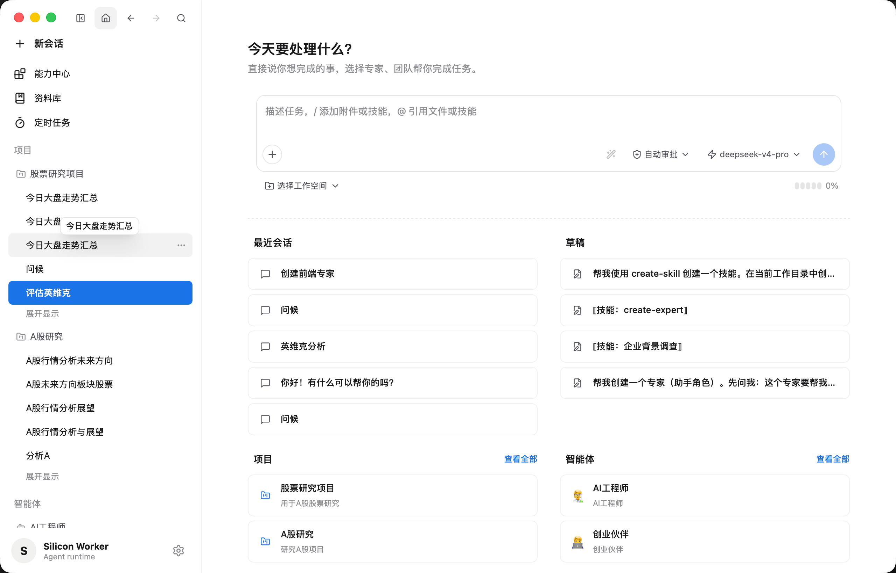
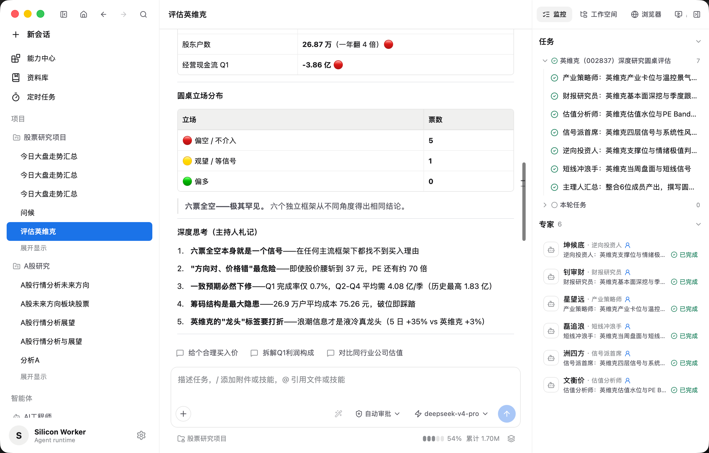
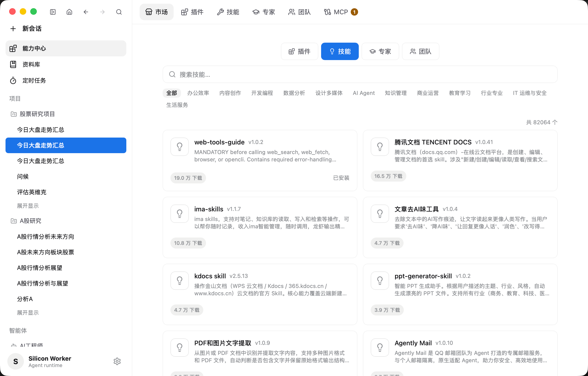
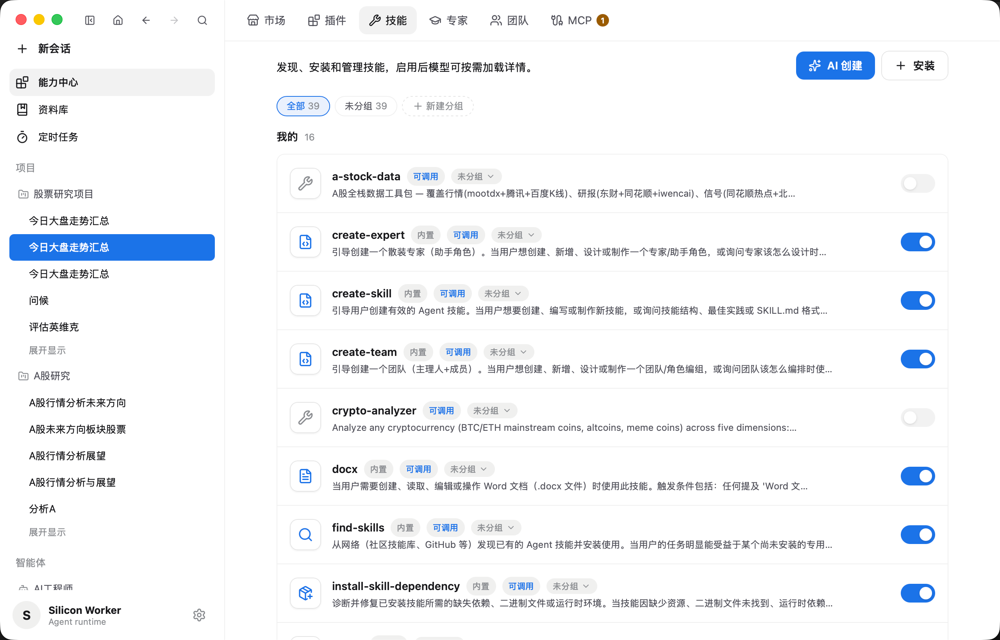
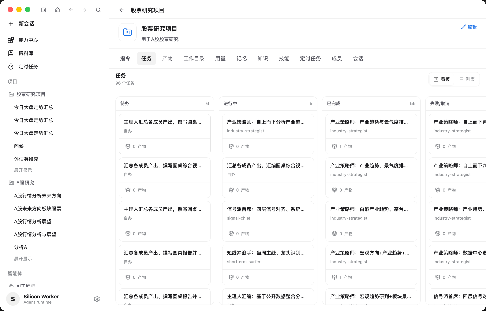
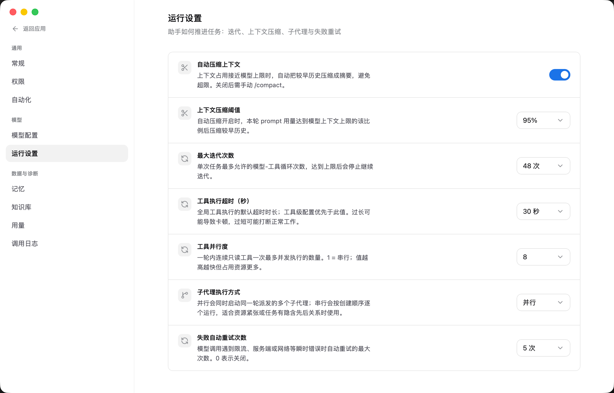

<div align="center">

# Silicon Worker · 硅基动力

**一个以「低安装、低配置、低授权、低使用成本」为核心目标的本地 Agent 桌面客户端**

Tauri 2 · Rust · React 18 + TypeScript · Vite · Tailwind · 本地 SQLite

[官网 www.silicower.com](https://www.silicower.com) · [English](README.en.md) · [发布说明](RELEASING.md) · [贡献指南](CONTRIBUTING.md)

</div>

---

## 这是什么

silicon-worker 是一个**装完即用、数据留在本机**的 AI Agent 桌面应用。你在应用内配置自己的模型（任意 OpenAI 兼容厂商，或 Anthropic 原生 API），它就能以多轮 ReAct 的方式自主调用工具帮你完成任务——读写文件、执行命令、检索网络、操作浏览器与桌面，全程在你的电脑上、按你的授权进行。

它当前采用「Tauri 桌面壳 + Rust runtime + 本地 SQLite + 本机工具」的形态，不是因为「本地桌面」本身是目的，而是因为这条路径能让用户**少部署、少配置、少依赖外部服务**，并能直接、安全地操作自己的电脑。打包后的应用**不要求你安装 Python 或 Rust**。

> **核心产品原则：不要用脆弱的业务关键词规则替代模型驱动的 Agent 行为。**
> 自然语言意图、任务规划、技能演进、记忆抽取与工作流适配都由模型驱动并经 schema 校验；只有高置信度的结构化信号才使用确定性规则。

## 界面预览

<div align="center">

**主页 · 直接说要做什么，选择专家 / 团队帮你完成**



**多专家团队协作 · 右侧监控面板实时展示任务与成员产出**



**能力市场 · 一键安装他人分享的技能 / 专家 / 团队 / 插件**



**能力中心 · 技能的启用、分组与 AI 创建 / 安装**



**项目任务看板 · 指令 / 任务 / 产物 / 记忆 / 知识一处聚合**



**运行设置 · 上下文压缩、迭代上限、子代理与失败重试**



</div>

## 核心特性

### 🤖 自主 Agent 引擎
- **多轮 ReAct 执行**：单轮内多轮「调模型 → 批量执行工具 → 观察 → 续跑」，带空响应/截断救援与未完成待办 nudge。
- **断点恢复与中断**：run 跑在独立线程，刷新或重开应用不中断正在进行的输出；可随时一键停止。
- **多会话隔离**：每个会话是一条独立的对话线，各自的历史、工作目录与运行态互不干扰。
- **一次性授权与澄清**：读操作直接执行，写/危险操作按权限模式先征求同意（同参数一次授权）；`ask_user` 可结构化地向你追问。

### 🔌 多模型 Provider
- **OpenAI 兼容**：覆盖 DeepSeek / Azure / DashScope / Ollama / OpenRouter 等。
- **Anthropic 原生**：通过 `/v1/messages` 调用 Claude，流式、工具调用、思考展示、缓存 token 采集全部对齐。
- 支持主/备模型路由与失败降级、辅助模型（用于标题、建议、消息增强等辅助调用）。

### 🛠️ 工具系统与沙箱
- 内置文件读写/搜索、命令执行、网页抓取与搜索、知识库检索等工具，workspace 根目录沙箱隔离。
- 并发安全的工具批量并行、非并发安全的串行执行。
- **桌面操作**（读取屏幕界面元素并点击/输入/滚动）与**浏览器操作**（独立自动化浏览器窗口，登录态跨会话复用）——均基于纯文本界面结构驱动，**任意模型（含非多模态如 DeepSeek）都能用**。
- **Apple 工具**（macOS）：日历、提醒事项（EventKit）、备忘录（自动化），高风险操作按权限模式确认。

### 🧩 能力体系：技能 / 专家 / 团队 / 插件
- **技能 Skills**：文件型 `SKILL.md`（YAML frontmatter），内置技能随应用内嵌、启动物化；支持拖拽 / zip / 目录安装、启停、卸载。
- **专家 Experts**：可编辑人设的能力模板，可**播种**出带**私有长期记忆**、跨会话记住你的**智能体（Agent）**。
- **智能体自我演化**：攒够新经历后自我反思，提出对人格（SOUL）的**改写提案**，经你批准才生效；身份锚（IDENTITY）永不被自动改动，版本可回滚。
- **团队 Teams**：会话级的多成员编排（lead + members）。
- **插件 Plugins**：面向标准生态（Claude / Codex 规范）的能力接入口，skill/agent/command/hook/mcpServers 全局公开。

### 🏪 能力市场
- 在「设置 → 市场来源」添加托管在 GitHub / Gitee 的**静态仓库地址**（托管零成本），把别人分享的技能 / 专家 / 团队一键「加入我的」。
- 广场按来源聚合展示并标注出处；第三方来源在添加与安装时都会先征求同意；市场可随时启用 / 停用 / 移除。
- 支持把「我的」专家 / 团队导出为市场仓格式，方便自建市场分享。

### 🧠 记忆、知识与可观测
- **长期记忆**：智能体跨会话记住你。
- **知识库**：可选的向量检索（智能查找）与向量模型配置。
- **用量分析**：按日期 / 模型 / 会话 / 小时统计 token（含缓存命中/写入与命中率）。
- **调用日志**：可选记录每次模型调用的完整请求/响应/token/耗时，覆盖主会话、子代理、标题/建议、上下文压缩、记忆整理等全部调用。

### 🔗 连接与自动化
- **MCP**：接入 Model Context Protocol 外部工具（含标准 OAuth auth-code + PKCE 流）。
- **定时任务**：scheduler 定时驱动 agent。
- **远程接入**：扫码绑定微信（ClawBot），在微信里与本地 agent 双向对话——派任务、收回复、用编号批准风险操作 / 回答追问 / 批准计划，工具全程仍在本地执行。
- **产物**：Agent 用 `add_artifact` 登记最终交付文件，侧栏与会话内联展示、点击预览。

## 技术栈

| 层 | 技术 |
| --- | --- |
| 前端 | React 18 · TypeScript 5 · Vite 5 · Tailwind CSS 3 |
| 桌面壳 | Tauri 2 |
| 后端 / runtime | Rust (edition 2021)，阻塞 + 线程模型 |
| 持久化 | 应用数据目录下的本地 SQLite（rusqlite bundled） |
| LLM | 用户在应用内配置的 OpenAI 兼容 / Anthropic 原生 API |
| 技能 | 本地 `SKILL.md` 文件，技能根目录 `~/.siliconworker/skills/` |

## 架构概览

```
┌─ silicon-worker（Tauri 2 桌面 app · 单进程单语言 Rust）──────────┐
│  React 18 + TS + Vite + Tailwind                                 │
│        │ Tauri invoke / emit("agent_stream_event")               │
│  Rust 后端                                                        │
│   ├ 平台地基                                                      │
│   │   AppState · AppDatabase(SQLite) · Provider 网关              │
│   │   命令注册 · 事件流机制                                       │
│   └ Agent 引擎                                                    │
│       engine(runner) · providers · tools · permission/ask        │
│       skills · experts/agents · teams · memory · scheduler       │
└──────────────────────────────────────────────────────────────────┘
```

**领域模型**保持简单，不做过度状态机：

```
Session            一条对话线（多会话，独立隔离）
  └ Message[]       user / assistant / tool；assistant 可带 tool_calls
       └ ToolCall / ToolResult   执行事实（命令/输入/exit/输出/状态）
  · Todo[]          轻量待办
  · Run             一次 user 输入 → 引擎跑到完成/等待（流式 + 断点恢复）
  · AskRequest      ask_user 澄清交互点
  · PermissionRequest  工具授权交互点（一次性同参授权）
  · Skill[]         可加载技能
```

## 快速开始（开发）

### 前置要求
- [Rust](https://rustup.rs/) 工具链（edition 2021）
- Node.js（建议 24.x）
- Tauri 2 的系统依赖（见 [Tauri 官方前置要求](https://tauri.app/start/prerequisites/)）
- macOS 上使用桌面/浏览器/Apple 工具时需按系统提示授予相应权限

### 安装依赖

```bash
npm install
```

### 本地开发（打开桌面窗口）

```bash
npm run tauri:dev
```

### 仅验证前端构建

```bash
npm run build   # tsc + vite build（不含 lint）
```

### 后端测试

```bash
cargo test --manifest-path src-tauri/Cargo.toml
```

### 打包桌面应用

```bash
npm run tauri:build
```

> 普通开发期间不需要每次都跑完整打包，它较慢。发布流程见 [RELEASING.md](RELEASING.md)。

## 使用一览

1. 首次启动进入引导页，在**设置 → 模型配置**添加你的厂商（OpenAI 兼容或 Anthropic）与 API Key。
2. 新建会话，可选设置**工作目录**（Agent 文件工具按会话解析沙箱根）。
3. 直接用自然语言派任务；Agent 自主调用工具，危险操作会先请你确认。
4. 按需在**能力中心**启用技能、创建专家 / 团队，或从**市场**安装他人分享的能力。
5. 在**设置**里开启桌面操作 / 浏览器操作 / Apple 工具 / MCP / 远程接入等高级能力。

## 项目结构

```
silicon-worker/
├── src/                    # 前端（React + TS）
│   ├── pages/              # 各功能页：session / experts / teams / plugins /
│   │                       #   skills / mcp / knowledge-bases / scheduling /
│   │                       #   remote / settings ...
│   ├── components/         # 通用组件
│   ├── hooks/  lib/  api/  # 状态、工具、Tauri command 绑定
│   └── App.tsx
├── src-tauri/              # 后端（Rust + Tauri）
│   ├── src/
│   │   ├── engine/         # ReAct 引擎 / runner
│   │   ├── provider/       # LLM provider 抽象（OpenAI 兼容 / Anthropic）
│   │   ├── tools/          # 内置工具 + 注册表 + 沙箱
│   │   ├── skill/  expert/  team/  plugin/   # 能力体系
│   │   ├── agent/  memory/  scheduler/       # 智能体 / 记忆 / 定时
│   │   ├── mcp/  browser/  desktop/  apple/  # 连接与本机操作
│   │   ├── market/  remote/  knowledge/      # 市场 / 远程 / 知识库
│   │   ├── commands/       # Tauri command 层
│   │   └── storage/        # SQLite
│   └── builtin-skills/     # 内置技能（xlsx/pdf/docx/pptx/create-* ...）
├── screenshots/            # 界面预览图
├── CONTRIBUTING.md         # 贡献指南与 CLA
└── RELEASING.md            # 发布说明
```

## 安全与隐私

- **数据留在本机**：会话、记忆、设置都存在应用数据目录下的本地 SQLite，模型 API 由你自配。
- **潜在破坏性操作需要确认**：覆盖 / 删除文件、批量移动重命名、读取敏感本地文件、涉及外部服务的 connector 操作。
- **原子文件工具默认避免覆盖**，优先安全写入 / 复制 / 重命名。
- **远程接入纯出站**：微信通道走长轮询，无需公网 relay；仅白名单 peer 可驱动。

## 参与贡献

欢迎 Issue 与 PR。参与方式、提交前验证与贡献者许可协议（CLA）见 [CONTRIBUTING.md](CONTRIBUTING.md)。

提交前请运行对应验证命令（后端 `cargo test`，前端 `npm run build`）。

## License

本项目采用 **[PolyForm Noncommercial License 1.0.0](LICENSE)** —— 一个**源码可见（source-available）、仅限非商业用途**的许可协议：

- ✅ 允许任何人**查看、学习、修改、分发**本项目源码，用于研究、学习、个人与非营利目的。
- 🚫 **禁止任何商业用途**。如需商业使用，请联系作者单独获取商业授权。
- 🏷️ 版权归作者所有（`leecho · leecho571@gmail.com`）；作者保留对本项目进行商业化的全部权利。

> 注意：PolyForm Noncommercial 属于「源码可见」许可，并非 OSI 认可的「开源」许可——它以禁止商业使用换取上述保护。
> 若你希望商业使用本项目，欢迎通过邮件联系洽谈授权。贡献方式与 CLA 见 [CONTRIBUTING.md](CONTRIBUTING.md)。

---

<div align="center">
<sub>Silicon Worker · 硅基动力 · <a href="https://www.silicower.com">www.silicower.com</a> · 让 Agent 装完即用、数据留在本机</sub>
</div>
