# Silicon Agent

[English](README.en.md) | 中文

Silicon Agent 是一款开源的 AI Agent 桌面客户端。（本地客户端小龙虾）它基于 Tauri 2 打包，使用系统 WebView 与 Rust 后端，不内置 Chromium，安装包体积和运行时占用通常显著小于 Electron 应用。它以单会话 Agent 循环（多轮推理、流式输出、工具调用、自动上下文压缩）为核心，接入你自己的 OpenAI-compatible 模型服务，配套一组聚焦的内置工具、基于文件的技能系统，以及可选的 IM 远程渠道接入。目标是提供一个低成本、可自托管、本地运行的 Agent，让它直接面向你的机器与文件工作。

## 功能特性

- **Agent 会话**：单会话 Agent 循环，支持流式响应、工具调用、中断/停止，以及自动上下文压缩。
- **内置工具**：文件读取 / 写入 / 编辑、`glob`、`grep`、`run_command`、`web_search`、`web_fetch`，以及交互 / 流程工具（`ask_user`、`update_todos`、`propose_plan`、`add_artifact`）。
- **基于文件的技能**：从 `~/.siliconagent/skills/` 加载、安装和查看 `SKILL.md` 技能；内置技能随应用发布，并在启动时落地到本地。
- **厂商与模型配置**：在应用内配置你自己的 OpenAI-compatible 接口地址、密钥和模型。
- **IM 远程渠道**：把来自 IM 渠道的消息路由进普通 Agent 会话。
- **可观测性**：用量统计与模型调用日志，便于排查请求、token 与成本。

## 截图

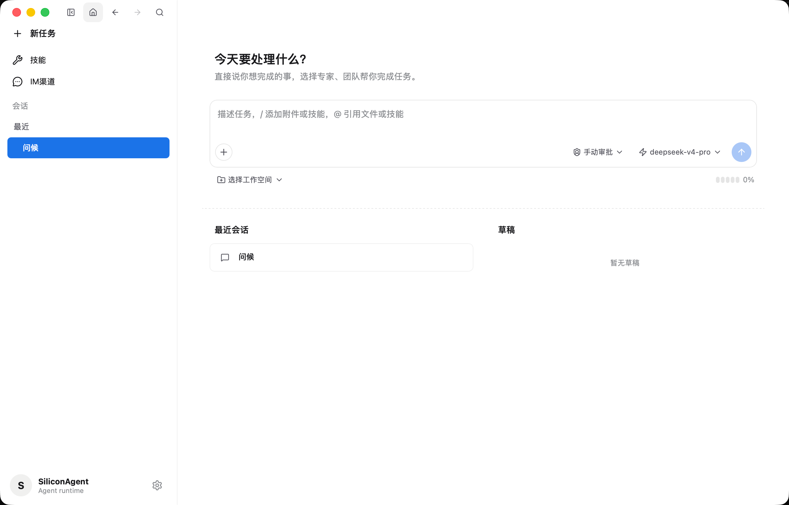
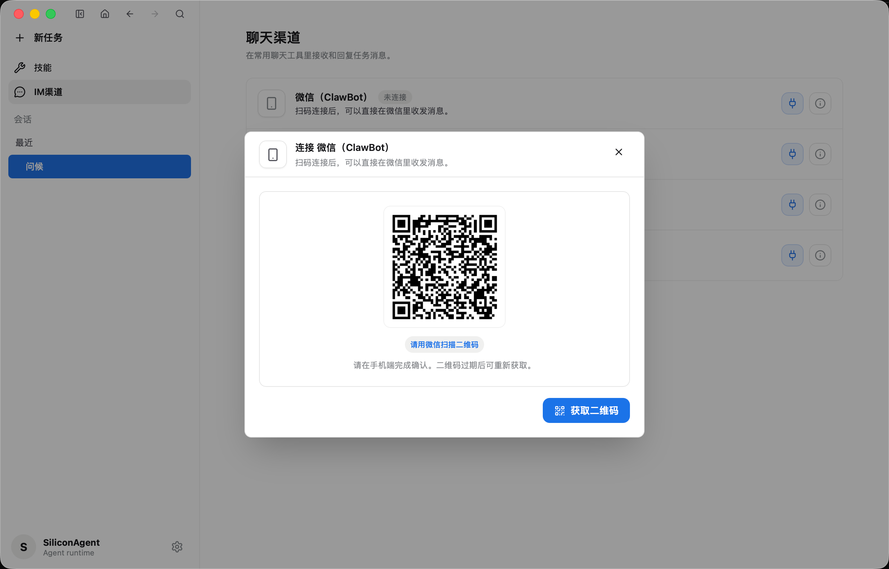
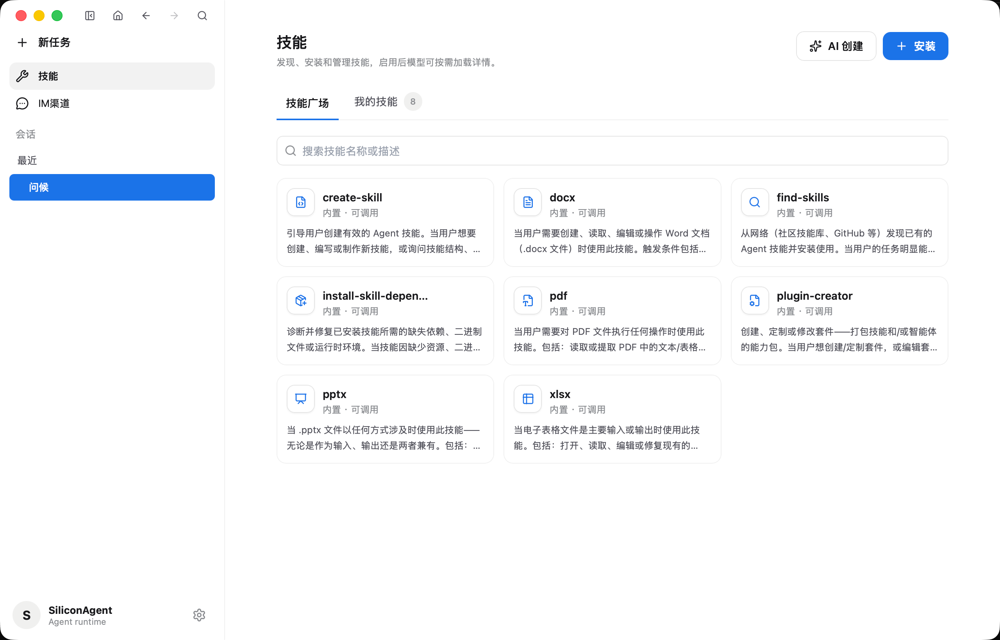
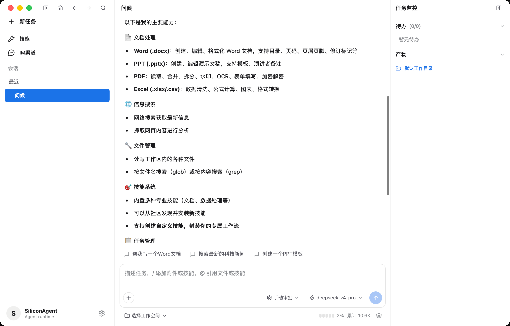
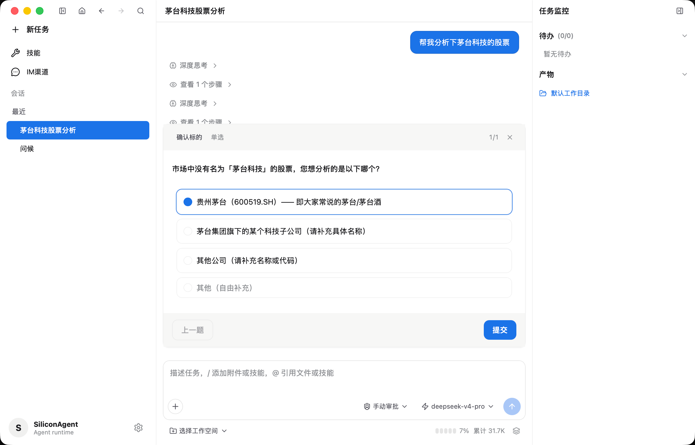
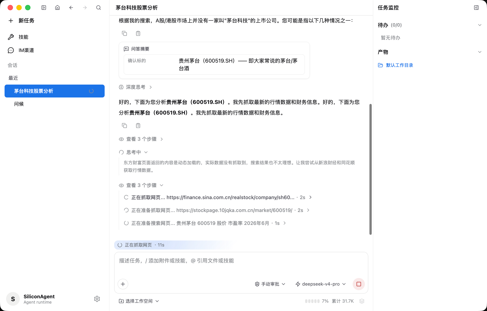
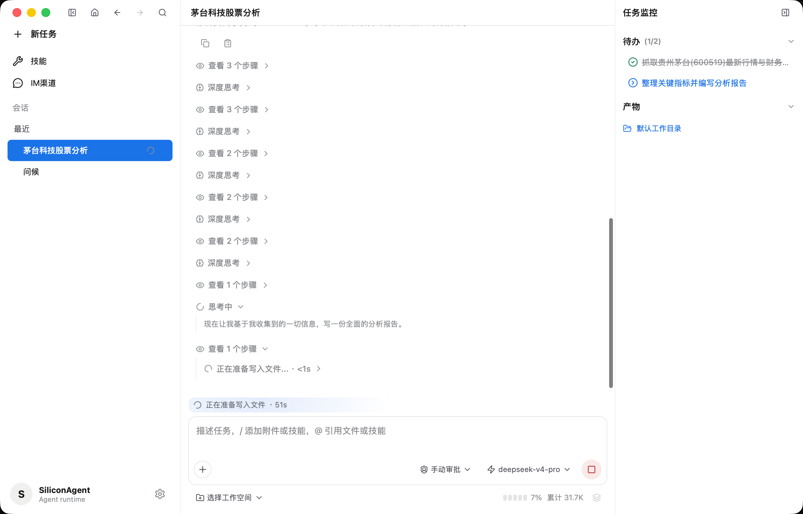
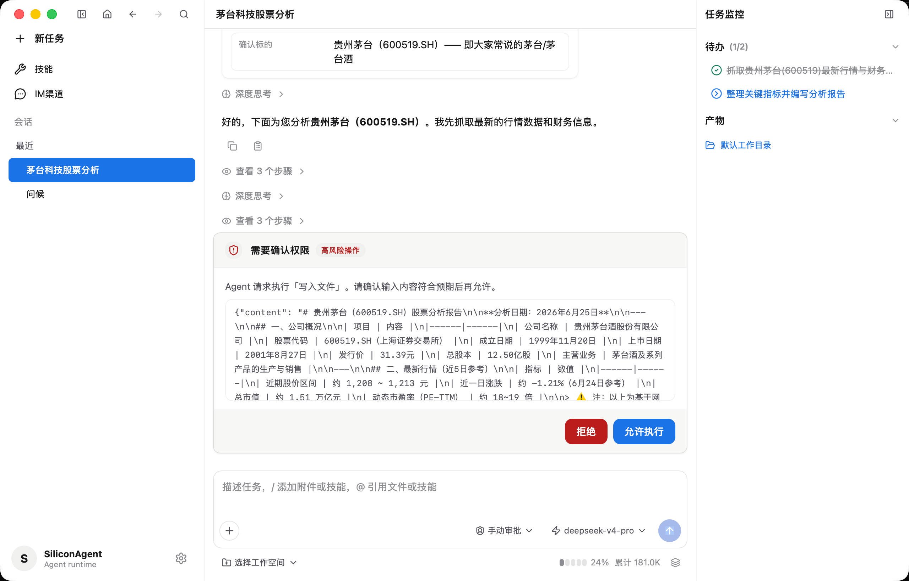
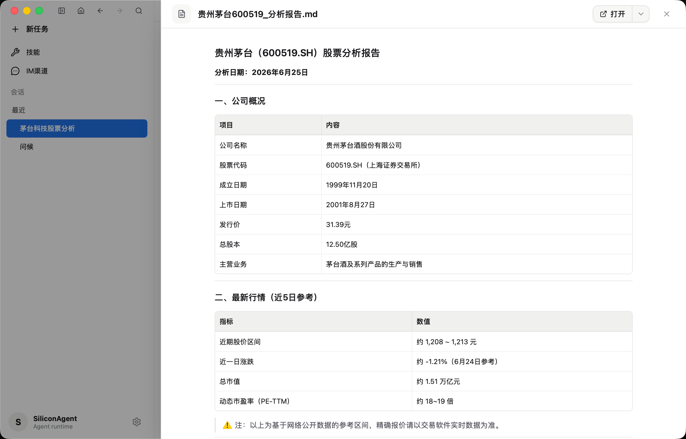
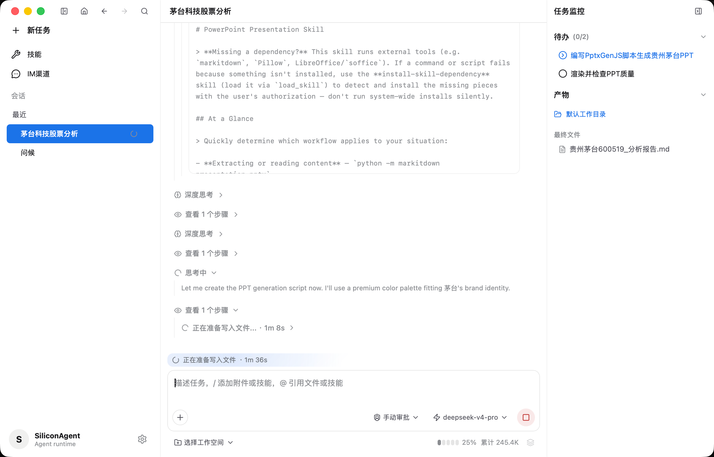
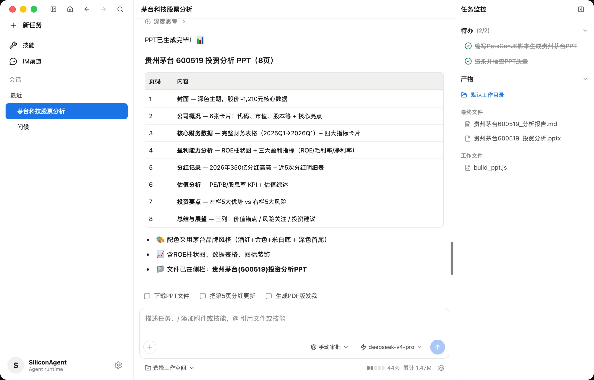
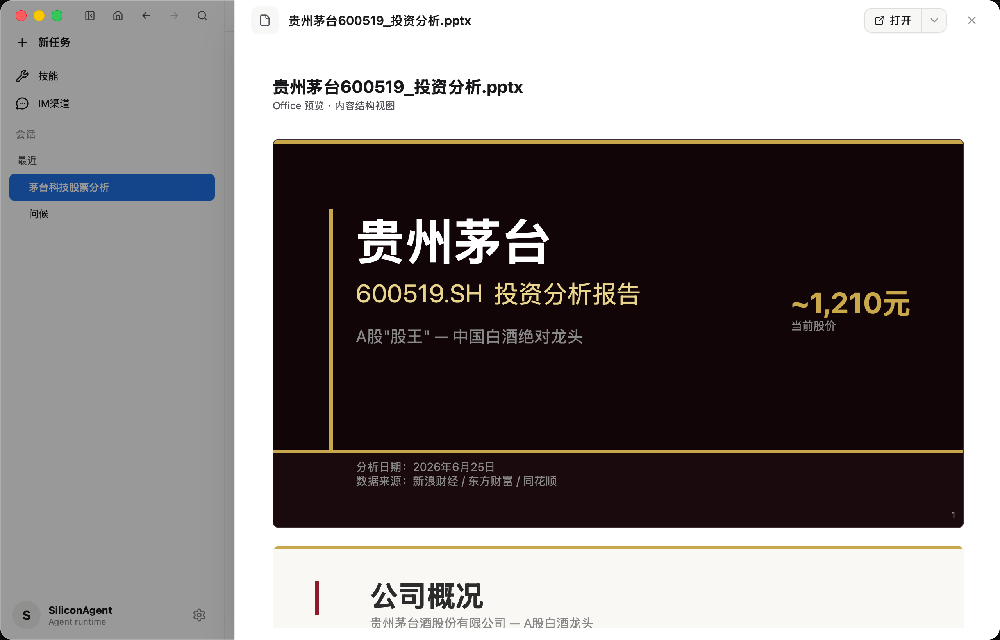
## 不包含

Silicon Agent 刻意保持为聚焦的核心。它**不包含**多智能体团队 / 专家、子代理派发、项目工作区、插件 / 套件、MCP 连接器、定时任务或长期记忆。如果你需要这些能力，可以了解下文的 **Silicon Worker**。

## 技术栈

Tauri 2 · Rust（edition 2021）· React 18 + TypeScript 5 · Vite 5 · Tailwind 3 ·
SQLite（rusqlite，bundled）

## 开发

打包后的应用无需 Python 或额外运行时。本地开发需要 Rust（含 cargo）和 Node.js。

后端测试：

```bash
cargo test --manifest-path src-tauri/Cargo.toml
```

前端构建：

```bash
npm run build
```

以开发模式运行桌面应用（会打开一个窗口）：

```bash
npm run tauri:dev
```

## 关于 Silicon Worker

Silicon Agent 是聚焦的开源核心；如果你需要更完整的能力，可以了解同系列的 **Silicon Worker** —— 一款面向本地工作的全功能 AI Agent 桌面客户端。在 Silicon Agent 的基础上，Silicon Worker 还提供：

- 多智能体协同与子代理（`dispatch_agent`）串行 / 并行调度
- 专家与团队协作目录
- 长期智能体工作台，以及 Agent 自我演化（SOUL 版本历史）
- 项目工作区、任务看板与项目级指令
- 插件与 MCP（stdio / http）扩展
- 记忆系统（用户画像、长期事实、项目 / 会话记忆）
- 定时任务，以及微信、钉钉、飞书、Telegram 等远程渠道
- 更细粒度的用量与审计统计

项目与发布：<https://github.com/leecho/silicon-worker-release>

## 许可

基于 GNU Affero General Public License v3.0 or later（AGPL-3.0-or-later）授权。详见 [LICENSE](LICENSE)。
